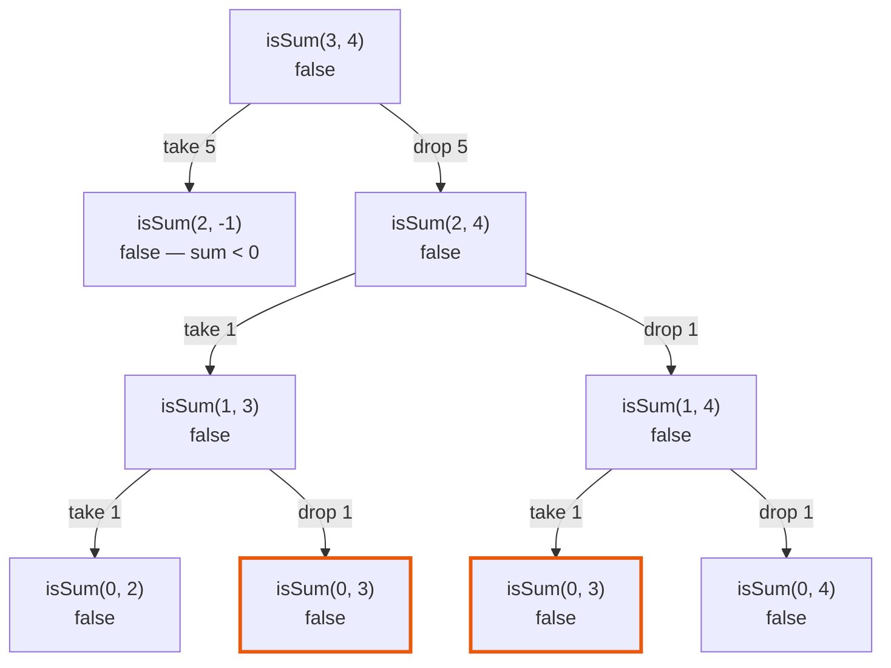

# 416. Partition Equal Subset Sum — Java Solutions

Six working Java solutions to
[LeetCode 416 · Partition Equal Subset Sum](https://leetcode.com/problems/partition-equal-subset-sum/),
from plain recursion to the one-array bottom-up version, with the reason each step is forced by the
one before it.

**The problem, in one line:** decide whether an array of positive integers can be split into two
groups with the same total.

---

## The reframe that makes it a known problem

The word *partition* suggests you have to build two groups and keep them balanced against each
other. You do not. Two observations collapse it:

- If the total is **odd**, no split is possible. Return false and stop.
- If the total is even, a valid split is exactly a subset summing to **total / 2** — because
  whatever is left over automatically sums to the other half.

So there is only ever *one* group to find, and one number to hit. LeetCode 416 is **subset-sum with
a fixed target**, and everything below is a subset-sum solution.

**What the reframe does not carry over.** Subset-sum in general asks for a target you are handed;
here the target is derived from the input, so it is bounded by `sum / 2` — at most 10,000 under this
problem's constraints. That bound is what makes a table possible at all, and it is the reason the
same code would be useless if the values were unbounded.

---

## Which approach actually passes

`n` is the number of elements, `target` is `sum / 2`. The constraints cap them at 200 and 10,000.

| # | Approach | Time | Space | Verdict on LC 416 |
|---|----------|------|-------|-------------------|
| 1 | [Plain recursion](../src/main/java/com/svetanis/algorithms/dp/sum/given/subseq/BalancedPartitionRecursive.java) | O(2ⁿ) | O(n) stack | **TLE** |
| 2 | [Memoized, `int[]`](../src/main/java/com/svetanis/algorithms/dp/sum/given/subseq/BalancedPartitionMemoization.java) | O(n · target) | O(n · sum) | Passes |
| 3 | [Memoized, `List`](../src/main/java/com/svetanis/algorithms/dp/sum/given/subseq/BalancedPartitionTopDown.java) | O(n · target) | O(n · target) | Passes |
| 4 | [Bottom-up, 2-D table](../src/main/java/com/svetanis/algorithms/dp/sum/given/subseq/BalancedPartitionBottomUp.java) | O(n · target) | O(n · target) | Passes |
| 5 | [Bottom-up, two rows](../src/main/java/com/svetanis/algorithms/dp/sum/given/subseq/BalancedPartitionSpaceOptimized.java) | O(n · target) | O(target) | Passes |
| 6 | [Bottom-up, one array](../src/main/java/com/svetanis/algorithms/dp/sum/given/subseq/BalancedPartitionSubmit.java) | O(n · target) | O(target) | Passes — submit this |

Only the first row fails, and everything below it finishes in single-digit milliseconds at the
largest input the judge can send. *(Row 1 is one algorithm written twice in the file — `canPartition`
indexes backward, `canPartition2` forward. Both are exponential, and which is faster **depends
entirely on the answer**: on false inputs the forward one is slower by a measured 1.0–1.2×, and on
true inputs it is faster by five orders of magnitude, because only it stops early. Rows 2 and 3 are likewise one algorithm over two input types, `int[]` and `List<Integer>`.)*

**That "everything below passes" is the surprise.** On
[LC 518 · Coin Change II](518-coin-change-ii.md) — the same knapsack recurrence, the same repo, the
same style of memoization — rows 2 and 3 crash with `StackOverflowError` and only the iterative
versions survive. Why the identical fix has opposite outcomes on the two problems comes down to one
word in the recurrence, and it is the most useful thing on this page.

*(Every timing quoted below was measured; the method and the raw figures are
[at the bottom](#how-these-were-measured).)*

---

## 1. Plain recursion

Walk the elements one at a time; each is either in the subset or out of it:

```
isSum(i, s) = isSum(i - 1, s - a[i])   // put a[i] in the subset
            | isSum(i - 1, s)          // leave it out
```

`isSum(i, s)` reads as *"can some subset of the first `i + 1` elements total exactly `s`?"* The
answer for the whole problem is `isSum(n - 1, sum / 2)`.

```java
private static boolean isSum(int[] a, int n, int sum) {
    if (sum == 0) {
        return true;
    }
    if (n < 0 || sum < 0) {
        return false;
    }
    // 1. include last element
    boolean incl = isSum(a, n - 1, sum - a[n]);
    // 2. exclude last element
    boolean excl = isSum(a, n - 1, sum);
    return incl || excl;
}
```

`sum == 0` is checked **before** `n < 0`, and the order matters: hitting the target exactly as the
elements run out is a success, not a failure.

### What the recursion actually explores

A tree small enough to read in full: **`nums = {1, 1, 1, 5}`**, total 8, so `target = 4`. The answer
is **false** — the reachable sums are 1, 2, 3, 5, 6, 7, 8, and 4 is not among them. A false case is
the honest one to draw, because it is where **no base case fires early**: every node is expanded and
the drawing shows the work actually done.

⚠️ **`isSum` does not short-circuit, and that is worth a moment.** It assigns both branches to
locals before combining them:

```java
boolean incl = isSum(a, n - 1, sum - a[n]);
boolean excl = isSum(a, n - 1, sum);
return incl || excl;
```

`||` short-circuits, but both statements have already run by the time it is reached. **The whole tree
is explored whatever the answer is.** Measured on `n` ones — an input that partitions evenly down
the very first path a short-circuiting search would take:

| `n` ones | `canPartition` | `canPartition2` |
|---|---:|---:|
| 20 | 9.6 ms | 0.005 ms |
| 26 | 142 ms | 0.004 ms |
| 30 | **2,218 ms** | **0.004 ms** |

`canPartition2` returns the moment it finds a subset, via an explicit `if (...) return true;`. Two
lines apart in the same file, and on a true input the difference is five orders of magnitude —
**assigning a recursive call to a local is a decision, not a formatting choice.**

Each node is `isSum(i, s)`. Left edge includes `a[i]`, right edge drops it.



Reading it:

- The leftmost branch dies immediately: taking the 5 overshoots a target of 4, so `sum` goes
  negative. That guard is the only pruning plain recursion has.
- The bottom row is `i = 0`, where one element is left — a single 1. Those nodes are false for
  every `s` except 0 and 1.
- **`isSum(0, 3)` appears twice** (outlined). "Took the first 1, then skipped the second" and
  "skipped the first, then took the second" are different paths that arrive at the identical
  question, and each recomputes it from scratch.

That duplication is the whole cost. Here it wastes one node. On a larger input of the same shape it
compounds exactly as `O(2ⁿ)` predicts — **every extra element doubles the running time**:

> 9 ms at n = 23 → 149 ms at n = 27 → **2.4 seconds at n = 31**.

LeetCode allows n = 200. Continuing that doubling to 200 elements does not describe a slow program,
it describes one that never finishes.

## 2 & 3. Add memoization — and here it is enough

Cache by `(i, s)`. Every distinct node in that tree is then computed once, and the work drops from
`2ⁿ` paths to `n · target` states:

```java
if (dp[n][sum] != null) {
    return dp[n][sum];
}
boolean incl = isSum(a, n - 1, sum - a[n], dp);
boolean excl = isSum(a, n - 1, sum, dp);
return dp[n][sum] = incl || excl;
```

The n = 31 input that took 2.4 seconds above now returns in **under a tenth of a millisecond**, and
the full n = 200 ceiling takes a few milliseconds. It passes.

### Why the same fix fails on Coin Change II and works here

This is the part worth carrying to the next problem. On
[LC 518](518-coin-change-ii.md) the memoized version has correct complexity and *still* crashes with
`StackOverflowError`. The two recurrences look nearly identical:

| | LC 518, take-branch | LC 416, take-branch |
|---|---|---|
| recursive call | `ways(i, amount - coins[i])` | `isSum(i - 1, sum - a[i])` |
| index on that branch | **stays at `i`** | **drops to `i - 1`** |
| deepest chain | `amount / min(coin) + n` — **5,300** frames at LC 518's ceiling | `n` — at most 200 frames |

Coins are unlimited, so 518's take-branch does not advance the index; its depth is governed by the
*value* of the input. Elements here are used at most once, so both branches advance, and depth is
governed by the *size* of the input — which the constraints cap at 200.

**The rule this gives you:** before memoizing a recursion, ask what the index does on every branch.
If some branch leaves it unchanged, the recursion depth is driven by a value rather than a count,
and top-down will overflow no matter how good the cache is. If every branch advances it, depth is
bounded by `n` and top-down is safe. On this problem it is safe, and by a wide margin.

### Where memoization beats the table, and where it loses

`O(n · target)` means different things for the two. Bottom-up fills every cell, so it is an exact
count. Memoization only ever visits a state some real chain of decisions can reach, so it is an
upper bound — and the gap between the bound and reality is set by how **coarse** the values are.

Two inputs, both at n = 200:

| Values | Share of the table memoization touches | Faster |
|---|---|---|
| all `100` | **under 1%** | memoized, by 3.8× |
| mixed `1..100` | **three quarters** | bottom-up, by 3.5× |

When every value is a multiple of 100 the only reachable sums are multiples of 100, so almost the
entire table describes totals no subset can produce and top-down never looks at them. Make the values
irregular and nearly every sum becomes reachable; the saving disappears and memoization is left
paying a recursive call and a `Boolean` unbox per state where the loop does a plain array read.

**The takeaway is not "top-down is faster."** It is that the two have different sensitivities.
Bottom-up's cost is fixed by `n · target` and nothing else; memoization's follows the reachable state
count, which the input can make tiny or not shrink at all. Neither is anywhere near the time limit
here, so this is a reason to understand row 2, not a reason to submit it.

### One difference between the two memoized files

They are the same algorithm over different input types — `int[]` for
[`BalancedPartitionMemoization`](../src/main/java/com/svetanis/algorithms/dp/sum/given/subseq/BalancedPartitionMemoization.java),
`List<Integer>` for
[`BalancedPartitionTopDown`](../src/main/java/com/svetanis/algorithms/dp/sum/given/subseq/BalancedPartitionTopDown.java) —
but their tables are not the same size:

```java
int sum = IntStream.of(a).sum();          // the FULL total: 20000 at the ceiling
Boolean[][] dp = new Boolean[n + 1][sum + 1];
return isSum(a, n - 1, sum / 2, dp);      // but the search starts at sum / 2
```

The `sum` parameter of `isSum` — its third argument, and the one used as the column index — enters at
`sum / 2`, and every recursive call either subtracts an element from it or passes it through
unchanged. **It can only go down.** So no column above `sum / 2` is ever reachable, and the table is
allocated twice as wide as anything that can index it: at the ceiling, 20,001 columns where 10,001
would do.

`BalancedPartitionTopDown` avoids this, and the reason is structural rather than lucky: it halves the
total in the *caller*, then allocates inside a method whose only notion of the target is the
parameter it was handed. The size and the starting index are read from the same variable, so they
cannot drift apart. Halving in one place and allocating in another is what opens the gap here.

The fix:

```java
Boolean[][] dp = new Boolean[n + 1][sum / 2 + 1];
```

The answer does not change and the judge still accepts either version. What the fix reclaims is two
million references — **a measured 7.7 MB of the 15.4 MB table**, allocated and never read once.

The habit is the real point: **size a DP table by the largest index that can reach it, not by the
largest number in the problem.** Those two coincide often enough that assuming they always do is a
quiet way to double your memory on the problem where they do not.

## 4. Bottom-up, 2-D table

Same recurrence, loops instead of calls:

```java
boolean[][] dp = new boolean[n + 1][target + 1];
dp[0][0] = true;                                  // no elements can make 0, by taking nothing
for (int i = 1; i <= n; i++) {
    for (int s = 0; s <= target; s++) {
        int diff = s - nums.get(i - 1);
        if (diff < 0) {
            dp[i][s] = dp[i - 1][s];              // element too big for this s: must skip it
        } else {
            dp[i][s] = dp[i - 1][s] || dp[i - 1][diff];
        }
    }
}
return dp[n][target];
```

`dp[i][s]` means *"can the first `i` elements make exactly `s`?"* Row 0 means "no elements
considered", which is what makes `dp[0][0] = true` the seed and lets an empty input answer instead
of index-erroring.

**Both reads are from row `i - 1`.** That is the 0/1 constraint written into the loop: to use
element `i` you consult a row in which it has not been used yet, so it cannot be taken twice. The
unlimited version of this problem — LC 518 — reads `dp[i][...]` on the take-branch instead, and that
single index is the entire difference between the two problems.

### The table, filled in

**`nums = {1, 5, 11, 5}`** — LeetCode's example 1, so `target = 11`. Row `i` is the state after the
first `i` elements; the answer is the bottom-right cell.

| `i` | element | 0 | 1 | 2 | 3 | 4 | 5 | 6 | 7 | 8 | 9 | 10 | 11 |
|---|---|---|---|---|---|---|---|---|---|---|---|----|----|
| 0 | *none* | **T** | · | · | · | · | · | · | · | · | · | · | · |
| 1 | `1` | T | T | · | · | · | · | · | · | · | · | · | · |
| 2 | `5` | T | T | · | · | · | T | T | · | · | · | · | · |
| 3 | `11` | T | T | · | · | · | T | T | · | · | · | · | **T** |
| 4 | `5` | T | T | · | · | · | T | T | · | · | · | T | **T** |

- **Row 0** is the seed: with no elements, only a sum of zero is reachable.
- Row 2 makes `{0, 1, 5, 6}` reachable — every subset of `{1, 5}`.
- **Row 3 answers the problem.** `dp[3][11]` becomes true, meaning the subset `{11}`, which leaves
  `{1, 5, 5}` as the other half.
- Row 4 adds `dp[4][10]`, and would have set `dp[4][11]` had it not already been true — the same
  answer reached the other way round, as `1 + 5 + 5`.

The answer cell is worth reading against the code, because it shows the two reads landing on the
same row:

```
dp[3][11] = dp[2][11] || dp[2][0]
    T     =     F     ||    T
                            ^ diff = 11 - 11 = 0, and row 2 says 0 is reachable
```

Both sources are on **row 2**, where the element `11` has not been considered. That is what stops it
from being counted twice. Change either `dp[2]` to `dp[3]` and you have written LC 518.

## 5. Bottom-up, two rows

Row `i` reads only row `i - 1`, so rows `0 .. i - 2` are dead weight. Keep two, and copy down after
each element:

```java
boolean[][] dp = new boolean[2][target + 1];
dp[0][0] = true;
for (int i = 1; i <= n; i++) {
    for (int s = 0; s <= target; s++) { ... }     // build row 1 from row 0
    for (int s = 1; s <= target; s++) {           // copy row 1 down, clear it
        dp[0][s] = dp[1][s];
        dp[1][s] = false;
    }
}
```

Worth pausing on the copy loop starting at `s = 1`: `dp[0][0]` is deliberately never overwritten. A
sum of zero is reachable at every stage by taking nothing, so that cell is a standing base case, not
leftover state from the previous element.

This version exists as the intermediate step. It has the same `O(target)` space as row 6 while still
looking like the 2-D recurrence, which makes the last step readable rather than magical.

## 6. Bottom-up, one array

Two rows collapse into one, if the scan runs in the right direction:

```java
public static boolean canPartition(int[] nums) {
    int sum = IntStream.of(nums).sum();
    if (sum % 2 != 0) {
        return false;
    }
    int target = sum / 2;
    boolean[] dp = new boolean[target + 1];
    dp[0] = true;
    for (int num : nums) {
        for (int s = target; s >= num; s--) {
            dp[s] = dp[s] || dp[s - num];
        }
    }
    return dp[target];
}
```

Eight lines, `O(target)` space, no recursion. This is the submission.

### Why one array is enough

The second row in section 5 does no work of its own. It exists so that results can be written
somewhere without disturbing the row still being read, and then copied down to become "the previous
row" for the next element. Write straight into the single array and both the row and the copy loop
are unnecessary — provided nothing reads a cell that this pass has already overwritten.

Only one cell is ever read: computing `dp[s]` reads `dp[s - num]`, and since values are positive
that index is always **lower** than `s`. So walking `s` downward is safe. Every cell below the one
being written is still untouched this pass, which is to say it still holds exactly what row `i - 1`
held.

Both versions drawn at the same instant — processing the last `5` of `{1, 5, 11, 5}`, about to write
`dp[8]`, which reads `dp[3]`:

```
  TWO ROWS — the rows are separated by ADDRESS

  s:          |  0  1  2  3  4  5  6  7  8  9 10 11
  old (dp[0]) |  T  T  .  .  .  T  T  .  .  .  .  T
              |           ^ read
  new (dp[1]) |  .  .  .  .  .  .  .  .  ?  .  T  T
              |                          ^ write
```

Reads come out of one array and writes go into another, so nothing can collide — which is why
section 5's inner loop can run *ascending* and still be correct.

```
  ONE ARRAY, descending — the rows are separated by TIME

  s:          |  0  1  2  3  4  5  6  7  8  9 10 11
  dp          |  T  T  .  .  .  T  T  .  ?  .  T  T
              |           ^ read         ^ write
              |  <---- still OLD row ---->  <-NEW->
```

**The write cursor is the boundary between the two rows.** Everything to its left still holds row
`i - 1`; everything to its right has already been rewritten into row `i`. The read at `dp[3]` sits
left of the cursor, so it delivers exactly what `dp[0]` delivered in the two-row picture.

That is the whole trade: the second row is replaced by a rule about *when* you visit each cell. It
costs nothing in memory and it is why the scan direction, irrelevant a moment ago, is now the thing
holding the algorithm together.

### Where the `if` went

Section 4 needs a branch for an element too big to fit the current sum:

```java
if (diff < 0) {
    dp[i][s] = dp[i - 1][s];      // copy the old value forward unchanged
}
```

With one array, the previous row and the current row *are the same memory*, so that assignment
copies a cell onto itself. It is not simplified away — it becomes a no-op, and iterations that do
nothing can simply not run. That is the whole content of the loop bound:

```java
for (int s = target; s >= num; s--)     // stop where diff would go negative
```

So section 6 has no `if` at all, and the disappearance is a consequence of the collapse rather than a
separate optimization.

### The same values, one row at a time

This computes exactly the table [in section 4](#4-bottom-up-2-d-table) — the single array passes
through those same five rows in order, overwriting each one instead of keeping it. What is new is
where the values are read from, and the last element of `{1, 5, 11, 5}` shows it.

One cell in detail — processing the last `5`, at `s = 10`:

```
dp[10] |= dp[5]
  F    |=   T
             ^
             └─ 5 was reachable BEFORE this element was considered ({5} = the first five),
                so {5} + this five = 10 uses two different elements
```

This is the downward scan doing its job: `dp[5]` is below `dp[10]`, so this pass has not reached it
and it still describes the world before the second five existed.

Reverse the direction and that stops being true, which is the same line of code solving the
unlimited-supply problem instead:

| Inner loop | Reads | Effect |
|------------|-------|--------|
| `for (s = target; s >= num; s--)` — **descending** | previous-element cells | each element **once** → LC 416 |
| `for (s = num; s <= target; s++)` — ascending | cells already updated this pass | element **reusable** → LC 518 |

---

## Two traps

### Reversing the inner loop silently solves the wrong problem

The most common mistake here, and it is invisible: the ascending version compiles, runs just as
fast, and returns a plausible boolean. It is answering *"can values be reused to reach the
target?"*, which is not the question.

On `{1, 2, 5}` the correct answer is **false**; the ascending version returns **true**. It goes wrong
on the very first element. Target is 4, and the array starts as `T . . . .`:

```
  ONE ARRAY, ascending — processing num = 1, now at s = 2

  s:          |  0  1  2  3  4
  dp          |  T  T  ?  .  .
              |     ^ read
              |  <-NEW->  <-OLD->

  s=1:  dp[1] |= dp[0]   ->  dp[1] = T    "1 is reachable"
  s=2:  dp[2] |= dp[1]   ->  dp[2] = T    "2 is reachable" -- reusing the same 1
```

Compare with the descending picture in section 6: there, the cell being read is always one the pass
has **not** reached, so it cannot already contain the current element. Here the regions are swapped,
the read lands on a cell written moments ago, and the element gets reused.

It agrees with the correct version on both of LeetCode's own examples, so testing against the samples
will not find this.

### Dropping the odd-total check corrupts the target

`sum / 2` on an odd total is integer division, so it truncates rather than failing. The code then
solves a real, well-formed subset-sum problem — against a target that corresponds to no partition at
all. On `{1, 2, 4}`, total 7, it hunts for 3, finds `1 + 2`, and reports **true** where the answer is
false.

The guard is not an optimization. It is the only thing standing between an odd input and a
confidently wrong answer.

---

## On the complexity

`O(n · target)` is **pseudo-polynomial**, not polynomial: `target` is a *value* from the input, and
writing it down takes `log(target)` bits, so the running time is exponential in the size of the
input as measured properly. Subset-sum is NP-complete and this table does not change that.

What makes it work on LeetCode is the constraint `nums[i] <= 100` with `n <= 200`, capping `target`
at 10,000 and the table at two million cells. Lift that cap — allow values up to `2³¹` — and the
same code becomes unusable while the exponential recursion is unaffected. Being able to say which of
the two constraints you are relying on is the point.

---

## How these were measured

Every number on this page was measured, not estimated, on one machine (JDK 25, default heap) — so
treat the ratios as the finding and the absolute milliseconds as indicative.

**Method.** 200 warm-up calls, then the **fastest of 100 timed calls**. The minimum is the stable
statistic here: it is the run least disturbed by JIT compilation and garbage collection, so
repeating the experiment barely moves it. Single-shot timings are not usable at this scale: two
inputs that build an identically sized table can come out at 3.1 ms and 6.7 ms, and that gap is
measurement noise rather than the algorithm.

The one exception is the plain-recursion growth table, which is a **single run per size**: at
hundreds of milliseconds to seconds per call, warm-up effects are already far below the signal, and
the doubling it shows is the only claim being made from it.

**The inputs**, all inside the problem's constraints. Three build a maximum-size table at n = 200;
the fourth is the one plain recursion is measured on, chosen so nothing prunes and nothing exits
early.

| Input | target | Why it is here |
|-------|--------|----------------|
| all values `100` | 10000 | the largest table the constraints permit |
| 199×`100` + one `98` | 9999 | same size, answer `false` — no early exit anywhere |
| mixed values `1..100` | 4999 | dense reachable sums; an average value near 50 halves the target. |
| `k` ones + one `k + 2` | 99 | target unreachable by exactly 1, and `sum < 0` never fires |

Times in milliseconds on the three large inputs, in that order:

| Approach | all `100` | one `98` | mixed |
|---|---|---|---|
| 2. memoized, `int[]` | 0.88 | 1.05 | 5.14 |
| 3. memoized, `List` | 0.46 | 0.44 | 5.94 |
| 4. bottom-up, 2-D | 3.34 | 3.35 | 1.46 |
| 5. bottom-up, two rows | 1.74 | 1.73 | 0.90 |
| 6. bottom-up, one array | 1.02 | 1.02 | 0.77 |

The bottom three rows barely move between the first two inputs and drop on the third, which is what
`n · target` predicts — the mixed input has half the target, so it is half the work. The memoized
rows move the opposite way, [for the reason above](#where-memoization-beats-the-table-and-where-it-loses).
State counts behind that, for **row 2** (`int[]`): 15,050 of 2,000,000 cells on the first input,
29,901 of 1,999,800 on the second, and 746,366 of 999,800 on the third.

**The two memoized files do not fill the same cells.** On the `one 98` input row 2 writes 29,901 and
row 3 writes **15,050** — one indexes backward from `a[199] = 98`, the other forward from
`a[0] = 100`, so they reach different state sets from the same input. Any count quoted for
"memoization" belongs to one of them, not both.

**Correctness.** All six files, seven entry points including `canPartition2`, agree with each other
and throw nothing.

---

## Related

Same package, same `include / exclude against a target` recurrence:

- [LC 494 · Target Sum](https://leetcode.com/problems/target-sum/) — assign `+` or `−` to every
  element to reach a goal. Reduces to this problem: the positives must total
  `(sum + goal) / 2`;
  see [TargetSumSpaceOptimized.java](../src/main/java/com/svetanis/algorithms/dp/sum/given/subseq/TargetSumSpaceOptimized.java).
- [LC 1049 · Last Stone Weight II](https://leetcode.com/problems/last-stone-weight-ii/) — minimize
  the difference between two groups instead of demanding zero. Same table, read the highest
  reachable `s ≤ target` rather than `dp[target]`;
  see [LastStoneWeightBottomUp.java](../src/main/java/com/svetanis/algorithms/dp/sum/given/subseq/LastStoneWeightBottomUp.java).
- [LC 698 · Partition to K Equal Sum Subsets](https://leetcode.com/problems/partition-to-k-equal-sum-subsets/) —
  the generalization to `k` groups, and it is **not** the same problem: with `k > 2` the leftovers
  no longer take care of themselves, so the table does not apply and it goes back to search with
  pruning;
  see [PartitionKEqualSumSubSets.java](../src/main/java/com/svetanis/algorithms/dp/sum/given/subseq/PartitionKEqualSumSubSets.java).
- [LC 518 · Coin Change II](518-coin-change-ii.md) — the unlimited-supply twin. Ascending inner
  loop, and the memoized version does not survive the judge.

All source files:
[`dp/sum/given/subseq/`](../src/main/java/com/svetanis/algorithms/dp/sum/given/subseq)
