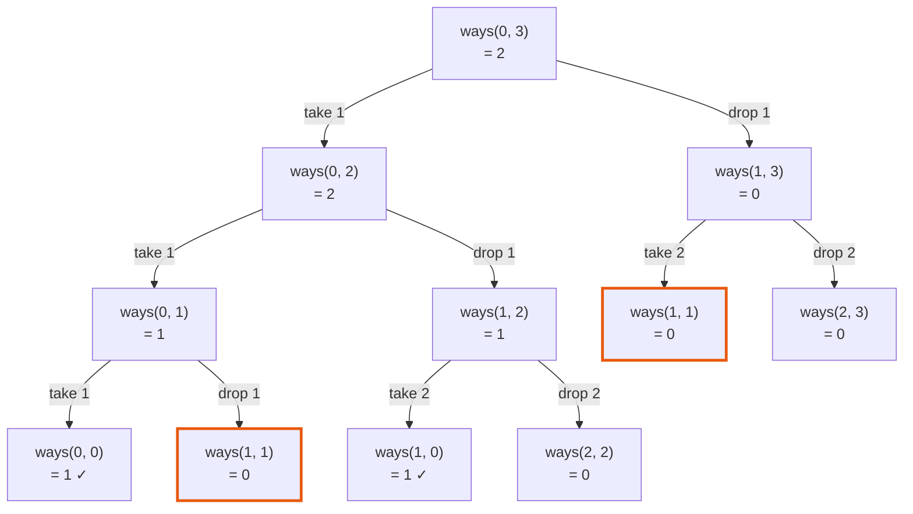

# 518. Coin Change II — Java Solutions

Five working Java solutions to [LeetCode 518 · Coin Change II](https://leetcode.com/problems/coin-change-ii/),
from plain recursion to the one-array bottom-up version, with the reason each
step is forced by the one before it.

**The problem, in one line:** given an unlimited supply of each coin, count how
many *unordered* combinations add up to a target amount. `1+2` and `2+1` are the
same combination and count once.

---

## Which approach actually passes

| # | Approach | Time | Space | Verdict on LC 518 |
|---|----------|------|-------|-------------------|
| 1 | [Plain recursion](../src/main/java/com/svetanis/algorithms/dp/coins/CoinChangeRecursive.java) | O(C(amount + n, n)) | O(n + amount) stack | **TLE** — ~7 s on `{1,2,5}` at amount 5000 |
| 2 | [Memoized, `int[]`](../src/main/java/com/svetanis/algorithms/dp/coins/CoinChangeMemoization.java) | O(n · amount) | O(n · amount) + O(n + amount) stack | **Risky** — needs ~0.8 MB of stack |
| 3 | [Memoized, `List`](../src/main/java/com/svetanis/algorithms/dp/coins/CoinChangeTopDown.java) | O(n · amount) | O(n · amount) + O(n + amount) stack | **Risky** — needs ~0.8 MB of stack |
| 4 | [Bottom-up, 2-D table](../src/main/java/com/svetanis/algorithms/dp/coins/CoinChangeBottomUp.java) | O(n · amount) | O(n · amount) | Passes |
| 5 | [Bottom-up, one array](../src/main/java/com/svetanis/algorithms/dp/coins/CoinChangeSubmit.java) | O(n · amount) | O(amount) | Passes — submit this |

The interesting part is row 2: memoization fixes the time complexity completely
and the solution *still* may not pass. That is the step most write-ups skip.

**On rows 1–3, two things worth being precise about.** `{1,2,5}` with amount 5000 is the *amount*
ceiling with three coins — it is not LeetCode's ceiling, which allows **300** coins. And the
"risky" verdict is a measurement of what the code needs, not an observed judge failure; §2 gives the
number and how it was obtained.

**At the real ceiling** — coins `1..300`, amount 5000, warm, best of 5 × 20 reps — the surviving
rows separate properly, which `{1,2,5}` hides:

| | `{1,2,5}` / 5000 | 300 coins / 5000 | table |
|---|---:|---:|---|
| memoized (rows 2, 3) | 0.152 ms | 23.5 ms | `Integer[301][5001]` — 11.5 MB of *references* alone |
| 2-D table (row 4) | 0.089 ms | 1.95 ms | `int[301][5001]` — 5.7 MB |
| one array (row 5) | 0.043 ms | **0.61 ms** | `int[5001]` — 19 KB |

*(At 300 coins the true count exceeds a signed `int` and every version returns the same negative
number. No legal LC test reaches this — the problem guarantees the answer fits — but a
ceiling-sized timing run does, and the garbage count is easy to mistake for a bug.)*

---

## 1. Plain recursion

At each position you either use the current coin again, or you stop using it and
move to the next one:

```
ways(i, amount) = ways(i, amount - coins[i])   // take coins[i] again
                + ways(i + 1, amount)          // stop using coins[i]
```

Two details carry the whole problem:

- Staying at `i` on the first branch is what makes each coin **unlimited**.
- Never going back to `i - 1` is what makes the count **unordered**.

```java
private static int count(List<Integer> coins, int index, int amount) {
    if (amount == 0) {
        return 1;
    }
    if (amount < 0) {
        return 0;
    }
    if (index >= coins.size() && amount >= 1) {
        return 0;
    }
    int incl = count(coins, index, amount - coins.get(index));
    int excl = count(coins, index + 1, amount);
    return incl + excl;
}
```

### What the recursion actually explores

A tree small enough to read in full: **coins `{1, 2}`, amount `3`**. Each node is
`ways(i, amount)` — `i` is how far into the coin array we are, `amount` is what
is left to make. Left edge takes the current coin again, right edge drops it and
moves on.



Reading it:

- A node returns **1** when `amount` hits 0 — that is one complete combination.
  The two `✓` leaves are the two answers: `1+1+1` and `1+2`.
- A node returns **0** when it runs out of coins with amount left over.
- **`ways(1, 1)` appears twice** (outlined). Two different paths — "used a 1, now
  skip to coin 2" and "skipped coin 1 entirely" — arrive at the identical
  question and both compute it from scratch.

That duplication is the whole problem. Here it costs one extra node; on
`{1, 2, 5}` with amount 5000 the same repetition compounds into **about 7 seconds**
(6.98 s and 7.05 s on two cold runs here; ~4.2 billion nodes), which is a
time-limit-exceeded verdict several times over. And that is only three
coins — at LeetCode's 300 the tree has 79 digits, so row 1 fails by a margin no
timing can express.

The fix writes itself: cache the answer per `(i, amount)` pair.

## 2 & 3. Add memoization — and the problem moves rather than going away

Caching by `(index, amount)` means every distinct node in that tree is computed
once, which collapses the work to `O(n · amount)`:

```java
if (dp[index][amount] != null) {
    return dp[index][amount];
}
int incl = dfs(coins, index, amount - coins[index], dp);
int excl = dfs(coins, index + 1, amount, dp);
dp[index][amount] = incl + excl;
return dp[index][amount];
```

This runs in about **1 ms** at the same input. The time problem is gone; a different one is not.

The reason is depth, not speed. The `incl` branch subtracts `coins[index]` and
recurses without advancing the index, so the deepest chain is
`amount / min(coin) + n` frames. With a coin of value 1 and amount 5000 that is
**5,003** — measured, not estimated — and **5,300** at LeetCode's ceiling of 300 coins. The `+ n` is
easy to drop and it is the part that carries the total past a 5,000-frame budget.

**How much stack that actually needs.** Sweeping `-Xss` on these two files at `{1,2,5}` / 5000,
three runs each:

| `-Xss` | result |
|---|---|
| 256k, 512k | `StackOverflowError`, every run |
| 768k | `StackOverflowError` on 2 of 3 — the boundary |
| 800k, 832k, 1m | clean, every run |
| **JVM default (1 MB here)** | **clean, every run** |

So the code wants roughly **800 KB**. Whether it crashes on LeetCode depends on the judge's stack
size, which is not published and cannot be measured from here — **so this page does not claim the
crash, it claims the requirement.** That is the more useful form anyway: 0.8 MB is a number you can
check against any judge, and it is why the two source files hedge the same claim as *"a risk rather
than a certain failure"*.

⚠️ **The depth is not a property of the input alone — coin order changes it.** Memoization caps
the first uncached chain, so `{1,2,5}` at amount 5000 reaches **5,003** frames while the same coins
given as `{5,2,1}` reach **1,005**. LeetCode does not promise sorted input, so a submission that
survives one ordering may not survive another. This is also why the depth is hard to pin down by
reading.

There are two files here because the two versions differ only in `int[]` versus
`List<Integer>` parameters. Same algorithm, same limit, same risk.

**The lesson:** memoization removes redundant work, but it keeps the call stack.
When the recursion depth is driven by the *input value* rather than the input
*size*, top-down is the wrong shape — the depth grows with `amount`, which the
problem statement lets reach 5000, while nothing in the language guarantees you
the stack for it. Going iterative removes the question instead of betting on the
answer, which is why rows 4 and 5 are the ones to submit.

## 4. Bottom-up, 2-D table

Same recurrence, filled with loops instead of calls, so there is no stack to
overflow:

```java
int[][] dp = new int[n + 1][amount + 1];
dp[0][0] = 1;                                         // one way to make 0: take nothing

for (int i = 1; i <= n; ++i) {
    int coin = coins.get(i - 1);
    for (int sum = 0; sum <= amount; ++sum) {
        int excl = dp[i - 1][sum];                    // skip coin i entirely
        int incl = sum >= coin ? dp[i][sum - coin] : 0;   // use it, and stay on row i
        dp[i][sum] = incl + excl;
    }
}
return dp[n][amount];
```

First version on this page that passes.

The table is `dp[coin][amount]` — rows indexed by *how many coins you have
considered so far*, which is the standard knapsack orientation. Row 0 means "no
coins yet", so there are `n + 1` rows, and it is the row that makes an empty
coin list return an answer instead of an index error. Staying on row `i` in the
`incl` branch is what allows a coin to be reused; dropping to `i - 1` there
would be the 0/1 version, where each coin may be taken once.

Keeping this orientation is also what makes the next step one line long.

## 5. Bottom-up, one array

Row `i` of that table only ever reads row `i - 1` and cells to its own left, so
rows `0..i-2` are dead weight. Keep one row:

```java
public static int coinChange(int[] coins, int amount) {
    int[] dp = new int[amount + 1];
    dp[0] = 1;
    for (int coin : coins) {
        for (int sum = coin; sum <= amount; sum++) {
            dp[sum] += dp[sum - coin];
        }
    }
    return dp[amount];
}
```

Five lines, `O(amount)` space, no recursion. This is the submission.

### Watching the array fill

**coins `{1, 2, 5}`, amount `5`** — LeetCode's own example 1. `dp[s]` always
means "ways to make `s` using only the coins processed so far". One row per coin:

| after | `dp[0]` | `dp[1]` | `dp[2]` | `dp[3]` | `dp[4]` | `dp[5]` |
|-------|-----|-----|-----|-----|-----|-----|
| *(start)* | **1** | 0 | 0 | 0 | 0 | 0 |
| coin `1` | 1 | 1 | 1 | 1 | 1 | 1 |
| coin `2` | 1 | 1 | 2 | 2 | 3 | 3 |
| coin `5` | 1 | 1 | 2 | 2 | 3 | **4** |

- **`dp[0] = 1`** is the seed: exactly one way to make nothing — take no coins.
- After **coin `1`**, every amount has exactly one combination, all 1s.
- After **coin `2`**, `dp[4] = 3`: `1+1+1+1`, `1+1+2`, `2+2`.
- After **coin `5`**, only `dp[5]` changes, gaining the single-coin `5`.
  Final answer **4**: `1+1+1+1+1`, `1+1+1+2`, `1+2+2`, `5`.

One cell in detail — processing coin `2`, at `sum = 4`:

```
dp[4] += dp[2]
 3   =  1  +  2
        ^     ^
        │     └─ ways to make 4-2 = 2, then add one more 2
        └─────── ways to make 4 without using any 2 yet
```

The subtle part: `dp[2]` was already updated to `2` earlier **in this same
pass** (at `sum = 2`). Reading the freshly-updated cell is exactly what lets a
coin be used more than once.

That is also the one-line difference from **0/1 knapsack**, where each item may
be taken once:

| Inner loop | Effect |
|------------|--------|
| `for (sum = coin; sum <= amount; sum++)` — ascending | reads updated cells → **unlimited** coins |
| `for (sum = amount; sum >= coin; sum--)` — descending | reads previous-row cells → **each item once** |

---

## Two traps

### The loop order decides which problem you solved

This is the single most common mistake on this problem, and it is invisible —
both versions compile, run fast, and return a plausible number.

```java
for (int coin : coins)                 // coin outer, sum inner
    for (int sum = coin; sum <= amount; sum++)
        dp[sum] += dp[sum - coin];     // counts COMBINATIONS  -> LC 518
```

```java
for (int sum = 1; sum <= amount; sum++)   // sum outer, coin inner
    for (int coin : coins)
        if (sum >= coin) dp[sum] += dp[sum - coin];   // counts PERMUTATIONS -> LC 377
```

With coin on the outside, every combination is built in one fixed coin order, so
`1+2` and `2+1` are counted once. With sum on the outside, each is counted
separately. The second form is
[LC 377 · Combination Sum IV](https://leetcode.com/problems/combination-sum-iv/),
which despite its name counts ordered sequences.

### Do not add a modulus

Counting problems often want the answer mod `1e9 + 7`, and it is easy to add one
here out of habit. **LC 518 guarantees the answer fits in a signed 32-bit int**,
so a modulus cannot protect anything — it can only corrupt a legal answer.

A concrete case, with the plausible-looking typo `MOD = 1000007`:

| Input | True answer | With `% 1000007` |
|-------|-------------|------------------|
| `{1,2,5}`, amount 5000 | 1,252,001 | 251,994 |
| `{1,2,5}`, amount 6000 | 1,802,401 | 802,394 |

Amount 5000 is LeetCode's own ceiling, so this is not a theoretical edge case —
the corrupted value is returned for inputs the judge actually uses, and it looks
like a perfectly ordinary count.

---

## Related

- [LC 322 · Coin Change](https://leetcode.com/problems/coin-change/) — *minimum*
  number of coins, not the count of ways. Different recurrence
  (`1 + min(...)` instead of a sum);
  see [MinCoinChangeSubmit.java](../src/main/java/com/svetanis/algorithms/dp/coins/MinCoinChangeSubmit.java).
- [LC 377 · Combination Sum IV](https://leetcode.com/problems/combination-sum-iv/) —
  same table, loops swapped, counts ordered sequences.
- [LC 279 · Perfect Squares](https://leetcode.com/problems/perfect-squares/) —
  minimum-coins shape where the coin set is the square numbers;
  see [PerfectSquaresBottomUp.java](../src/main/java/com/svetanis/algorithms/dp/coins/PerfectSquaresBottomUp.java).
- CSES *Coin Combinations II* is the same problem with a required modulus.

All source files: [`dp/coins/`](../src/main/java/com/svetanis/algorithms/dp/coins)
